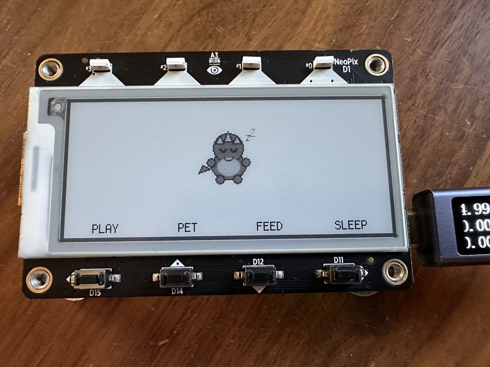

# FridgeFriend 🦕



A virtual pet for your fridge! Tamagotchi-style companion built for the Adafruit MagTag e-ink display.

## Features

- **Cute chibi dinosaur** that lives on your MagTag
- **Four interactions** via the front buttons:
  - **D15 (A)**: Play - dino jumps excitedly with cheerful chirps
  - **D14 (B)**: Pet - dino shows hearts and purrs happily
  - **D12 (C)**: Feed - dino chomps on food
  - **D11 (D)**: Sleep - dino curls up for a nap
- **Day/Night awareness**: Dino looks sleepy from 6PM to 6AM
- **Cute sounds** for each interaction
- **NeoPixel feedback** when pressing buttons

## Hardware

- [Adafruit MagTag](https://www.adafruit.com/product/4800)
- CircuitPython

## Setup

### 1. Install CircuitPython

Flash CircuitPython to your MagTag following [Adafruit's guide](https://learn.adafruit.com/adafruit-magtag/circuitpython).

### 2. Install Required Libraries

Copy these libraries from the [CircuitPython Bundle](https://circuitpython.org/libraries) to your `CIRCUITPY/lib` folder:

- `adafruit_magtag/` (folder)
- `adafruit_portalbase/` (folder)
- `adafruit_bitmap_font/` (folder)
- `adafruit_display_text/` (folder)
- `adafruit_io/` (folder)
- `adafruit_minimqtt/` (folder)
- `adafruit_ntp.mpy`
- `adafruit_requests.mpy`
- `adafruit_connection_manager.mpy`
- `adafruit_fakerequests.mpy`
- `neopixel.mpy`
- `simpleio.mpy`

### 3. Copy Files to MagTag

Copy to your `CIRCUITPY` drive:

- `code.py`
- `dino.py`
- `sounds.py`
- `sprites/` (entire folder)

### 4. Configure WiFi (Optional)

For accurate day/night mode, create a `secrets.py` file on your CIRCUITPY drive:

```python
secrets = {
    "ssid": "YourWiFiNetworkName",
    "password": "YourWiFiPassword",
    "tz_offset_hours": -6,  # UTC offset: -6=Central, -5=Eastern, -8=Pacific
}
```

Time syncs via NTP on first boot. The RTC keeps time through deep sleep but resets on power loss.

## Customization

### Custom Sprites

Replace the BMP files in `sprites/` with your own 64x64 pixel, 4-color grayscale images. Use these colors for best e-ink results:

- White: `#FFFFFF`
- Light Gray: `#AAAAAA`
- Dark Gray: `#555555`
- Black: `#000000`

### Custom Sounds

Edit `sounds.py` to change the tone sequences. Each sound is a list of `(frequency_hz, duration_seconds)` tuples.
